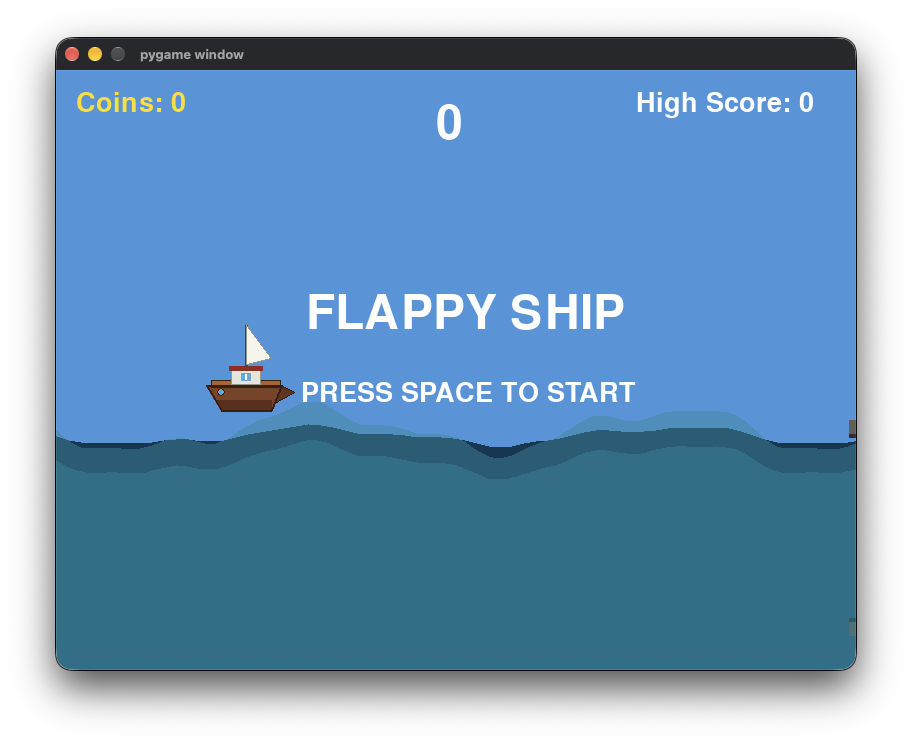
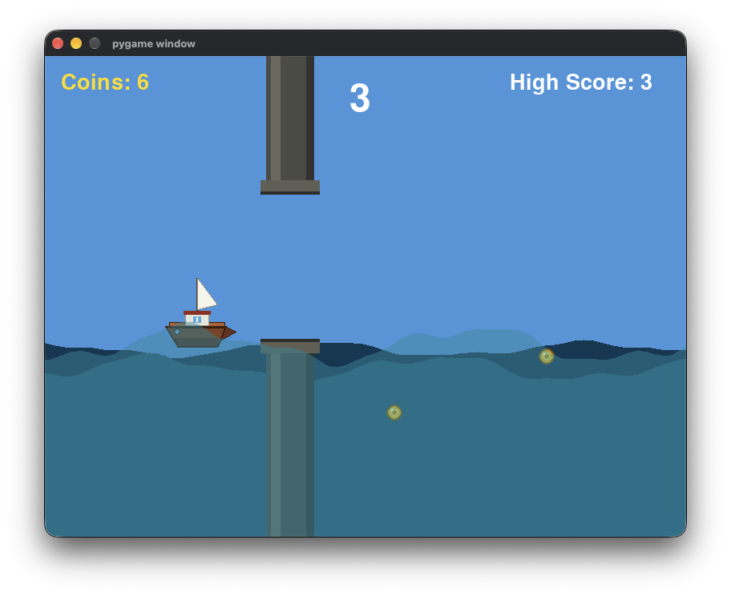
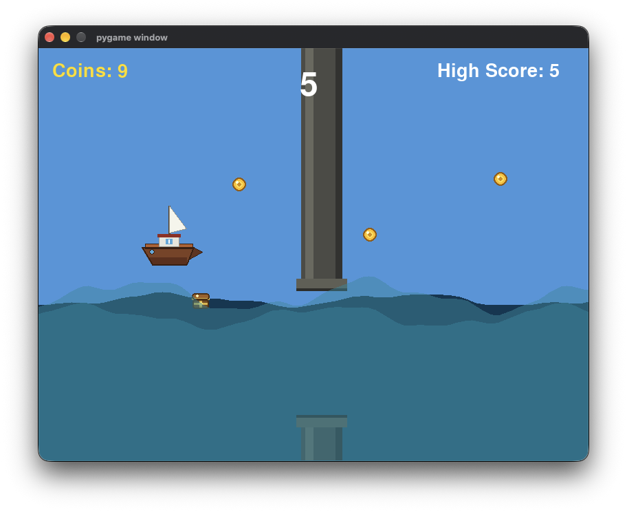
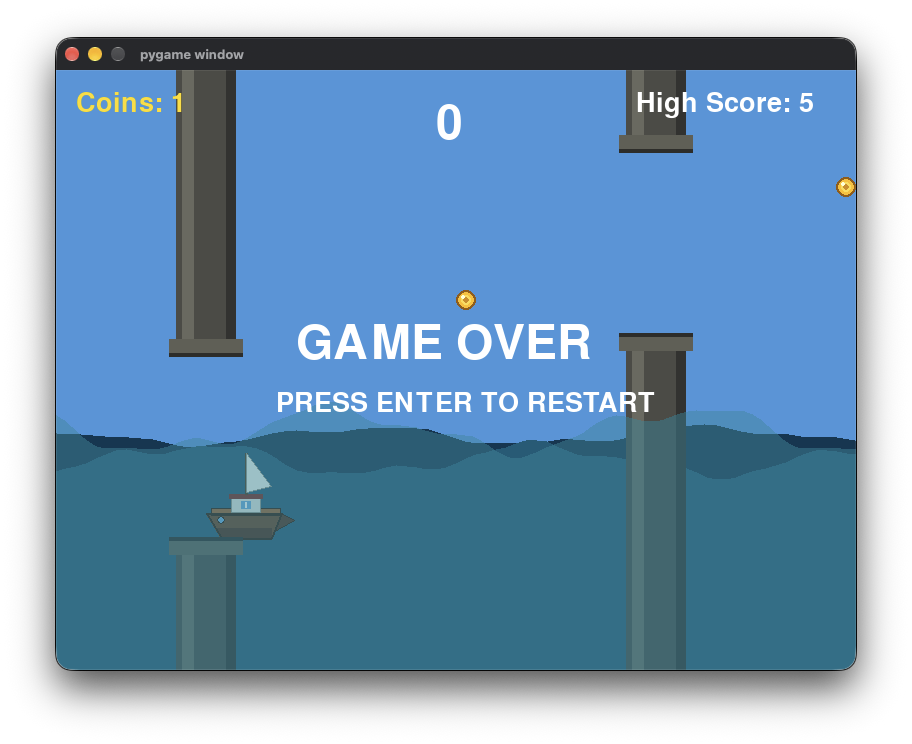

<div align=center>


</div>

> A fast-paced pirate-themed arcade game built with Python, Pygame, and Pygbag.

<div align=center>

[View Source](https://github.com/Haricharan97/Farmrush/blob/main/FlappyShip/main.py) · [Open Demo](https://haricharan97.github.io/FlappyShip/)


</div>

---

## About

FlappyShip is a flappy-bird inspired arcade game where you control a Pirate Ship hunting treasure across a ocean.

Each coin collected increases your score. Avoid marine ruins while trying to survive as the game gets progressively faster.

FlappyShip is built with **Python and Pygame** and uses **Pygbag** to run directly in the browser.

---

## Features

- Retro Flappy Bird style movement
- Treasure hunting and score tracking
- Random marine ruins obstacles
- Bonus treasure box worth 5 coins 
- Browser support with Pygbag

---

## How to Play

1. Press `SPACE` to start.
2. Use `SPACE` to fly around the sky.
3. Collect coins to increase your score.
4. Collect treasure box for extra points.
5. Avoid marine ruins and falling in the ocean or flying way to high in sky.
6. Survive for as long as possible.

---

## Controls

`SPACE` = Fly

---

## Gallery

| Start Screen | Gameplay | Treasure | Game Over|
|---|---|---|-----|
|  |  |  |  |


---

## Run Locally

Install Pygame:

```bash
pip install pygame
```

Run the game:

```bash
python FlappyShip/main.py
```

To build the browser version:

```bash
pip install pygbag
python -m pygbag --build FlappyShip
```

---

Made with **Python, Pygame, and Pygbag**.

With love ~ **Haricharan & Azmeer** ❤️

<div align=center>

# FlappyShip

</div>
